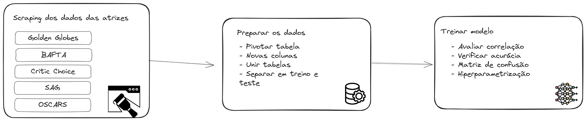

# Project's idea:

- Analyze the influence of other awards on the Best Actress  winner at the Oscars 
- Analyze the last 10 years winners
- Train a ML model to predict this years winner

## Diagrama com a pipeline

## Awards to look for:

- SAG Awards 
- Golden Globes
- BAFTA
- Critics' Choice Awards

# Possíveis Colunas

year
name
movie
indicada_sag
indicada_gg
indicada_os
indicada_bafta
indicada_cc
ganhou_sag
ganhou_os
ganhou_bafta
ganhou_cc
ganhou_gg

OBS: ganhou_gg é a coluna target

# Treino com ML

- Random Forest
- Logistic Regression
